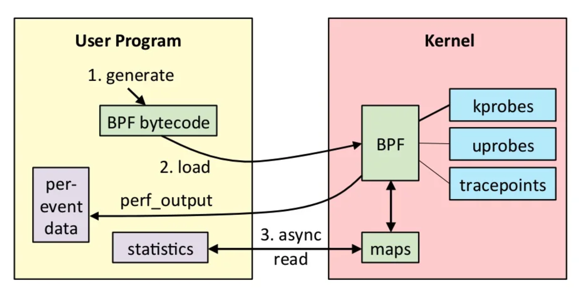

## 定位系统瓶颈

新的系统或者功能在上线前一般会遇到各种各样的瓶颈，或是BUG,内存泄漏抑或是性能瓶颈，这就需要我们能够了解整个系统的运行状况并快速定位系统的瓶颈。俗话说：工欲善其事，必先利其器。linux提供了丰富的定位工具，比如perf，ptrace，eBPF等，除此之外还有丰富的工具可供使用，比如valgrind和gperftools等。

### 系统监控

1. 查看系统配置

* lscpu

Linux操作系统下，cpu相关的信息一般存在于proc文件夹下面的cpuinfo文件中。通过cat /proc/cpuinfo可以查看。更常用的命令是lscpu。在lscpu中我们可以看到CPU的Architecture表示架构信息是x86_64架构，CPU(s)共96个核，NUMA nodes表示2个numa组，其中0-47个核属于numa0，48-95核属于numa1。CPU MHz表示CPU的主频，L1d cache，L1i cache,表示L1cache的大小，L1cache分别指令缓存和数据缓存。L1/ L2 cache为各个CPU独自拥有的。L3 cache是每个numa组内共享的，Flags表示支持的ISA指令集等等信息。

```
Architecture:        x86_64
CPU op-mode(s):      32-bit, 64-bit
Byte Order:          Little Endian
CPU(s):              96
On-line CPU(s) list: 0-95
Thread(s) per core:  2
Core(s) per socket:  24
Socket(s):           2
NUMA node(s):        2
Vendor ID:           GenuineIntel
CPU family:          6
Model:               85
Model name:          Intel(R) Xeon(R) Platinum 8361HC CPU @ 2.60GHz
Stepping:            11
CPU MHz:             2593.906
BogoMIPS:            5187.81
Hypervisor vendor:   KVM
Virtualization type: full
L1d cache:           32K
L1i cache:           32K
L2 cache:            1024K
L3 cache:            36608K
NUMA node0 CPU(s):   0-47
NUMA node1 CPU(s):   48-95
Flags:               fpu vme de pse tsc msr pae mce cx8 apic sep mtrr pge mca cmov pat pse36 clflush mmx fxsr sse sse2 ss ht syscall nx pdpe1gb rdtscp lm constant_tsc rep_good nopl cpuid tsc_known_freq pni pclmulqdq ssse3 fma cx16 pcid sse4_1 sse4_2 x2apic movbe popcnt tsc_deadline_timer aes xsave avx f16c rdrand hypervisor lahf_lm abm 3dnowprefetch invpcid_single pti fsgsbase bmi1 hle avx2 smep bmi2 erms invpcid rtm mpx avx512f avx512dq rdseed adx smap clflushopt clwb avx512cd avx512bw avx512vl xsaveopt xsavec xgetbv1 avx512_bf16 arat avx512_vnni
```

* free

内存及IO相关的系统一般存在于proc文件夹下面的meminfo文件中，通过cat /proc/meminfo可以查看。更常用的命令是free -h，free中可以看到total代表总的内存大小，used代表已使用的内存大小，buffer/cache的内存大小，available的内存大小。可以发现total的大小等于free的内存加上buff/cache的内存大小再加上used的大小。这里的buff/cache包括的是page cache和buffer cache的大小之和。page cache用作文件系统的文件缓存。比如进程对文件read/write操作或者mmap调用时使用。buffer cache也是block cache是用作系统对块设备读写时的缓存。在Linux内核中通过/proc/sys/vm/drop_caches来清理buff/cache。可以通过echo 3>/proc/sys/vm/drop_caches来清理buff/cache的内存。需要注意的是tmpfs的内存占用也是显示在buff/cache中的。swap表示的是交换内存的信息，如果未开启，则显示的都是0。

```
              total        used        free      shared  buff/cache   available
Mem:          278Gi        13Gi       134Gi       1.0Gi       129Gi       262Gi
Swap:            0B          0B          0B
```

* top

​		top通常是查看系统负载，CPU利用率，进程内存使用情况最常使用的工具。Load average中的三个数字分别代表1分钟，5分钟，15分钟的正在运行或者等待运行的进程个数。top -u user可以查看某个用户的进程信息。top -p pid查看某个进程的信息。如果想要查看某个cpu的信息，可以使用mpstat -P coreid来查看。

top 中最常关注的还有RSS，一般指的是物理内存的占用情况。RSS越大就证明进程的内存占用越多，如果持续增长有可能是内存泄漏的问题。

* vmstat

​	vmstat也是监控系统的常用指令之一。vmstat中包括了 CPU使用，内存使用，虚拟内存交换swap，IO使用情况，每秒上下文切换cs等信息。其中cs代表线程切换时进程上下文切换的次数。cs越大证明线程切换的代价越大，对性能的影响也会比较大。

* iostat

​	iostat包含了 IO统计信息， 通过iostat -x 1命令可以查看IO utils，观察IO是否达到了系统瓶颈，如果IO一直处于较高的利用率，可以考虑使用RAID磁盘阵列或者更换更快的SSD盘来提升IO的吞吐。


### 定位性能常用工具

系统性能中最常用的两个指标是吞吐量和延时。对于服务器而言，延时代表的是一次访问所需要的耗时。而吞吐代表的是一段时间内的访问的总次数。一般来说，延时越低，吞吐量越大，系统的性能就越好。

#### perf

预备知识：PMU,PMC

PMU,即perf monitor unit，性能监控单元。每个 PMU 模型包含一组寄存器：性能监视配置 (PMC) 和性能监视数据 (PMD)。这两个寄存器都是可读的，但只有 PMC 是可写的。这些寄存器用于储存配置信息和数据。

Perf,也叫perf events，或perf tools,是Linux内核提供的性能分析工具。perf是基于perf_event_open的内核系统调用。支持硬件性能计数(HPC),软件性能计数，kprobe，uprobe, tracepoints等多种事件。以PMC为例，perf执行的原理如下：

1. 通过sys_perf_event_open()的系统调用向内核注册一个PMC的计数器并在内核中通过mmap申请内存用于保存采样结果。
2. PMC通过专用的寄存器随CPU cycles的增长而累加，当PMC溢出时，PMU会产生一个PMI硬件中断。
3. 在中断函数中完成一次采样：采样信息包括HPC计数值，触发中断的指令地址，时间戳，PID等信息。并存入perf_event_open()申请的内存中
4. perf通过read读取采样信息，根据PID等信息找到对应进程，并根据进程ELF符号表解析为对应的函数调用信息。


Perf events：Perf_events包括以下几种类型：

* 硬件事件：PMU产生的CPU性能监控计数
* 软件事件：基于Kernel技术的事件，比如CPU migrations, minor faults, major faults,等

- 内核追踪事件：内核级别的插桩点
- 动态追踪: 包括内核态kprobe和用户态的uprobe事件。
- 时间采样: perf可以指定采用频率，通过 `perf record -F*Hz*`命令。


通过perf list可以查看当前perf支持的perf events。

```
List of pre-defined events (to be used in -e):

  alignment-faults                                   [Software event]
  bpf-output                                         [Software event]
  context-switches OR cs                             [Software event]
  cpu-clock                                          [Software event]
  cpu-migrations OR migrations                       [Software event]
  dummy                                              [Software event]
  emulation-faults                                   [Software event]
  major-faults                                       [Software event]
  minor-faults                                       [Software event]
  page-faults OR faults                              [Software event]
  task-clock                                         [Software event]

  duration_time                                      [Tool event]

  msr/tsc/                                           [Kernel PMU event]

  rNNN                                               [Raw hardware event descriptor]
  cpu/t1=v1[,t2=v2,t3 ...]/modifier                  [Raw hardware event descriptor]
   (see 'man perf-list' on how to encode it)

  mem:<addr>[/len][:access]                          [Hardware breakpoint]
  
  ......
  sched:sched_stat_blocked                           [Tracepoint event]
  sched:sched_stat_iowait                            [Tracepoint event]
  sched:sched_stat_runtime                           [Tracepoint event]
  sched:sched_stat_sleep                             [Tracepoint event]
  sched:sched_stat_wait                              [Tracepoint event]
  skb:consume_skb                                    [Tracepoint event]
  skb:kfree_skb                                      [Tracepoint event]
  skb:skb_copy_datagram_iovec                        [Tracepoint event]
  ......
```

以上是perf version 5.4.119版本的输出结果，从中我们可以看到Software event，比如常用的cpu-clock, context-switches, page-faults, Hardware breakpoint, 比如mem, Tracepoint event 比如常见的sched, skb等等。不同版本的perf event可能不一样，如果发现某些events不存在可以通过升级perf来解决。

在root用户下执行perf 命令，可以看到指定-e 来指定需要跟踪的perf events，使用方式如下

```
perf top -e <event list>
perf stat –e <event list>
perf record –e <event list>
```


#### FlameGraph

perf提供了丰富的采用工具，但对于性能分析来说不够直观，而火焰图是更常使用的分析性能的工具。火焰图又叫做[FlameGraph](https://github.com/brendangregg/FlameGraph)，是由Brendan Gregg开源的一个性能分析工具。火焰图可以从横向和纵向两个方向来分析，

纵向表示调用栈，每一层都是一个函数。调用栈越深，火焰就越高，顶部就是正在执行的函数，下方都是它的父函数。

横向表示不同的采样信息，如果一个函数在横向占据的宽度越宽，就表示它的采样次数越多。

**火焰图就是看最上层的哪个函数占据的宽度最大。宽度越大，就表示该函数在整个性能采样中占用的时间最长，更可能是系统的瓶颈点，需要重点关注。**

火焰图的使用方式如下

```
1. 通过perf record 选择需要记录的perf events，采集生成perf.data, --pid指定perf监控的端口号，-o表示输出的文件 -a表示所有cpu， -g表示加入调用堆栈信息
perf record -ag  --pid 23250 -o perf.data

2.通过FlameGraph工具生成火焰图
perf script解析采用的perf.data生成堆栈信息
perf script -i perf.data &> perf.unfold

3. 解析perf script生成的堆栈信息列表，输出逗号分隔的堆栈即count计数。
./stackcollapse-perf.pl perf.unfold &> perf.folded

4. 输出为svg图
./flamegraph.pl perf.folded > perf.svg
```

on-cpu & off-cpu

```x86asm
On-CPU：线程在 CPU 上运行的时间。
Off-CPU：计时器、分页/交换等上阻塞时所花费的时间。
```

Off-CPU 是一种用于测量和研究 CPU时间之外以及上下文堆栈跟踪的性能分析方法。它不同于 On-CPU 仅分析在 CPU 上执行的线程。它的目标是分析被阻止线程状态，Off-CPU 外分析是对 On-CPU 分析的补充。此方法也不同于应用程序阻塞的跟踪技术，因为此方法针对内核调度程序被阻塞原因的分析，比应用程序阻塞分析的应用场景更广。

造成线程Off-CPU 的原因有很多，包括 I/O 和锁，但也有一些与当前线程的执行无关的原因，包括由于对 CPU 资源的高需求而导致的非自愿上下文切换和中断。无论出于什么原因，如果在工作负载请求（同步代码路径）期间发生这种情况，则造成延迟。


#### BPF

BPF,eBPF,BCC

BPF全称是**Berkeley Packet Filter**，翻译过来是**伯克利包过滤器**，BPF诞生在1992年，最初是为了解决 Unix 内核实现网络数据包过滤的问题。BPF的主要原理是在内核中设计了一个新的BPF虚拟机可以有效地工作在基于寄存器结构的 CPU 之上，应用程序使用缓存只复制与过滤数据包相关的数据，不会复制数据包的所有信息，最大程度地减少BPF 处理的数据，提高处理效率。常用的抓包工具tcpdump就是基于BPF技术实现的。

eBPF全称是**enhanced Berkeley Packet Filter**。eBPF的原理是用户程序中编译生成BPF字节码指令，并加载到 BPF JIT 模式的虚拟机中，在虚拟机中将字节码指令转成内核可执行的本地指令运行。eBPF提供可基于系统或程序事件高效安全执行特定代码的通用能力，且具有很高的执行效率。其使用场景不再仅仅是网络分析，可以基于eBPF开发性能分析、系统追踪、网络优化等多种类型的工具和平台。

BCC全称是**BPF Compiler Collection**，是python封装的eBPF工具集。基于 BCC 实现的各种跟踪 BPF 程序，可以查看到必要的内核的内部结构。BCC 提供了内置的 Clang 编译器，可以在运行时编译 BPF 代码，以实现运行在目标主机上的特定内核中。

在BCC中有很多工具可以使用，比如常见的off-cpu定位工具，可以得到off-cpu的火焰图。

```
#/usr/share/bcc/tools/offcputime -df -p `pgrep -nx mysqld` --state=2 30 > out.stacks
# /usr/share/bcc/tools/offcputime -df -p `pgrep -nx mysqld` 30 > out.stacks
[...copy out.stacks to your local system if desired...]
# git clone https://github.com/brendangregg/FlameGraph
# cd FlameGraph
# ./flamegraph.pl --color=io --title="Off-CPU Time Flame Graph" --countname=us < out.stacks > out.svg
```



#### 定位内存泄漏

##### 1. valgrind

*Valgrind*是一款用于内存调试、内存泄漏检测以及性能分析的软件开发工具。常用检查项如

（1）Memcheck。这是valgrind应用最广泛的工具，一个重量级的内存检查器，能够发现开发中绝大多数内存错误使用情况，比如：使用未初始化的内存，使用已经释放了的内存，内存访问越界等。

（2）Callgrind: 检查程序中函数调用过程中出现的问题。

（3）Cachegrind: 检查程序中缓存使用出现的问题。

（4）Helgrind: 检查多线程程序中出现的竞争问题。

（5）Massif: 检查程序中堆栈使用中出现的内存泄漏问题。

valgrind的使用方法如下

```
valgrind --tool=memcheck --leak-check=full ./main
```

##### 2. gperftools

gperftools是Google开源的性能分析工具

（1）CPU profiler：捕捉程序运行时的CPU profilter信息

（2）Heap Profiler：捕捉程序运行时出现的堆栈内存使用信息

（3）Heap Checker：捕捉程序运行时出现的堆栈内存泄漏问题

（4）TCMalloc：thread-cached 内存管理工具。

（5）pprof : 用于生成可视化和分析堆栈图

gperftool的使用方法如下

```
LD_PRELOAD=/usr/local/lib/libprofiler.so CPUPROFILE=test.prof ./main

pprof -gv ./main test.prof
```

##### 3. asan检查

编译选项

GCC ：-fsanitize=address：开启内存越界检测


参考文档：

https://brendangregg.com/